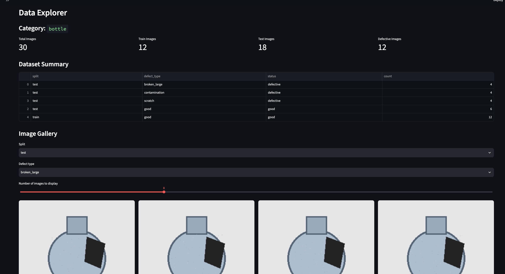
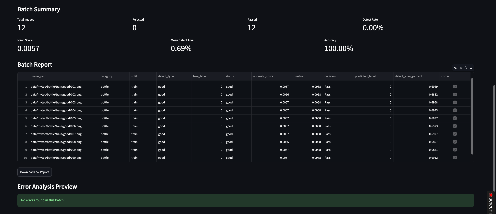
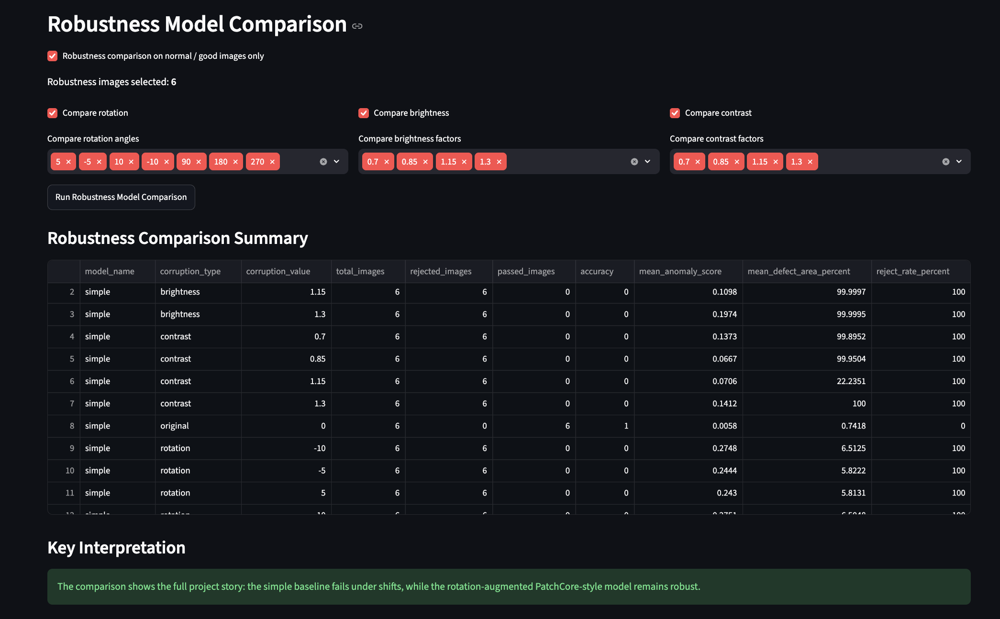

# FactorySense-R

**Robust Industrial Anomaly Detection Under Real-World Shifts**

FactorySense-R is an educational and practical computer vision project for industrial quality inspection.

The goal is to detect visual anomalies in industrial product images, generate anomaly heatmaps, and make Pass/Reject decisions under real-world shifts such as rotation, lighting changes, limited normal samples, and defect scale variation.

---## Dashboard Preview

### Data Explorer

### Batch Inspection

### Model Comparison

## Result Files

The main result CSV files are available here:

- [Clean test model comparison](assets/results/bottle_test_model_comparison_summary.csv)
- [Robustness model comparison](assets/results/bottle_test_robustness_model_comparison_summary.csv)

## Project Goals

- Build an industrial anomaly detection pipeline
- Start with training-light models suitable for a MacBook
- Generate anomaly scores and anomaly heatmaps
- Calibrate thresholds for Pass/Reject decisions
- Analyze robustness under real-world image shifts
- Build an educational Streamlit dashboard
- Keep the project clean and reproducible on GitHub

---

## Current Implementation

The current version includes:

- MVTec-style dataset explorer
- Synthetic demo dataset generator
- Simple difference-based anomaly detector
- Threshold calibration with multiplier and margin
- Single-image inspection dashboard
- Batch inspection dashboard
- CSV report generation
- Error analysis preview
- Robustness testing dashboard

---

## Results

Current results are documented here:

[FactorySense-R Results](docs/results.md)

## Dashboard Preview

### Robustness Model Comparison

## Demo Dataset

For the first development phase, the project uses a lightweight synthetic MVTec-style demo dataset.

The demo dataset contains:

- Category: bottle
- Train good images: 12
- Test good images: 6
- Test defective images: 12
- Defect types: broken_large, contamination, scratch

This allows the full pipeline to be tested without downloading the full MVTec AD dataset.

---

## Simple Baseline Model

The first anomaly detector is an educational pixel-difference baseline.

Pipeline:

1. Normal training images
2. Average normal reference image
3. Pixel difference map
4. Anomaly score
5. Calibrated threshold
6. Pass / Reject decision

This model is intentionally simple. Its purpose is to teach the anomaly detection workflow before moving to stronger feature-based models such as PatchCore and PaDiM.

---

## Batch Inspection Result

On the clean synthetic demo dataset, after threshold calibration:

- Total test images: 18
- Rejected images: 12
- Passed images: 6
- Accuracy: 100%
- Errors: 0

This means the model correctly rejects defective images and passes normal images in the clean demo setting.

---

## Robustness Result

The robustness dashboard tests the model under:

- Rotation
- Brightness changes
- Contrast changes

Normal-only robustness test result:

- Original normal images:
  - Reject rate: 0%
  - Accuracy: 100%

- Shifted normal images:
  - Reject rate: 100%
  - Accuracy: 0%

This shows that the simple pixel-difference baseline is not robust to real-world shifts.

---

## Key Learning

The current baseline works on clean aligned images, but it fails under lighting, contrast, and rotation changes.

This is an important finding for industrial anomaly detection:

> A model can look accurate on clean benchmark-style data but fail under real-world visual shifts.

This motivates the next phase of the project: replacing the simple pixel baseline with feature-based anomaly detection models such as PatchCore and PaDiM.

---

## Planned Pipeline

Image → Preprocessing → Anomaly Detection Model → Anomaly Score + Heatmap → Threshold Calibration → Pass / Reject / Risk Level → Dashboard + CSV Report

---

## Main Models

### Phase 1: Simple Difference Baseline

Already implemented as an educational baseline.

### Phase 2: PatchCore

PatchCore will be added as the first feature-based anomaly detection baseline.

### Phase 3: PaDiM

PaDiM will be added as a lightweight statistical baseline.

### Optional Future Models

- EfficientAD
- WinCLIP / AnomalyCLIP

---

## Robustness Experiments

FactorySense-R evaluates model stability under:

- Normal data diversity
- Image rotation
- Lighting changes
- Contrast changes
- Small vs large defects
- Limited normal samples
- Threshold sensitivity

---

## Project Structure

factorysense-r/
├── app.py
├── configs/
├── scripts/
├── src/factorysense/
├── notebooks/
├── tests/
├── data/
├── models/
├── outputs/
├── reports/
└── assets/

---

## Current Status

- [x] Project architecture planned
- [x] Repository structure initialized
- [x] Data explorer
- [x] Synthetic MVTec-style demo dataset
- [x] Simple baseline anomaly detector
- [x] Threshold calibration
- [x] Single-image inspection dashboard
- [x] Batch inspection dashboard
- [x] CSV reporting
- [x] Robustness experiments
- [x] Robustness dashboard
- [ ] PatchCore baseline
- [ ] PaDiM comparison
- [ ] Full MVTec AD evaluation
- [ ] Final GitHub presentation

---

## Next Phase

The next development phase will add a PatchCore baseline.

Planned improvements:

- Use pretrained CNN features instead of raw pixel differences
- Build a normal feature memory bank
- Generate feature-based anomaly maps
- Compare PatchCore against the simple baseline
- Re-run robustness tests under rotation, brightness, and contrast shifts
- Analyze whether PatchCore reduces false positives under real-world shifts

---

## Limitations

- The first version uses a synthetic demo dataset.
- The simple baseline is not robust to lighting, contrast, and rotation shifts.
- Real factory deployment requires calibration with real production data.
- Stronger feature-based models are needed for real industrial inspection.

## Robustness Improvement: Rotation-Augmented PatchCore-style

After testing the simple baseline and the first PatchCore-style model, we found three key results.

### 1. Simple Baseline

The simple pixel-difference baseline works on clean aligned demo images, but fails under real-world shifts.

- Clean test accuracy: 100%
- Brightness shift: fails
- Contrast shift: fails
- Rotation shift: fails

On normal-only shifted images, the simple baseline rejected all normal images.

### 2. PatchCore-style Feature Baseline

The first PatchCore-style model uses ResNet18 patch features and a memory bank of normal image features.

Results:

- Clean test accuracy: 100%
- Robust to brightness changes
- Robust to contrast changes
- Still sensitive to rotation

This shows that feature-based anomaly detection is more stable than raw pixel difference, but pose/rotation shift still causes false positives.

### 3. Rotation-Augmented PatchCore-style

To improve rotation robustness, the normal memory bank was augmented with rotated versions of normal training images.

Rotation angles used:

- -10 degrees
- -5 degrees
- 5 degrees
- 10 degrees
- 90 degrees
- 180 degrees
- 270 degrees

Final result on the synthetic demo dataset:

- Clean accuracy: 100%
- Brightness robustness: 100%
- Contrast robustness: 100%
- Rotation robustness: 100%

This means the rotation-augmented PatchCore-style model reduced false positives under rotation without losing defect detection performance.

---

## Current Technical Finding

The project now demonstrates an important industrial anomaly detection lesson:

> Robustness is not automatic. It must be tested, measured, and improved.

The simple baseline looked strong on clean data but failed under shifts.  
The PatchCore-style feature model improved lighting and contrast robustness.  
The rotation-augmented memory bank improved rotation robustness.

This makes FactorySense-R more than a dashboard demo: it is now an educational robustness analysis pipeline.

## License

This project is licensed under the MIT License. See [LICENSE](LICENSE) for details.
